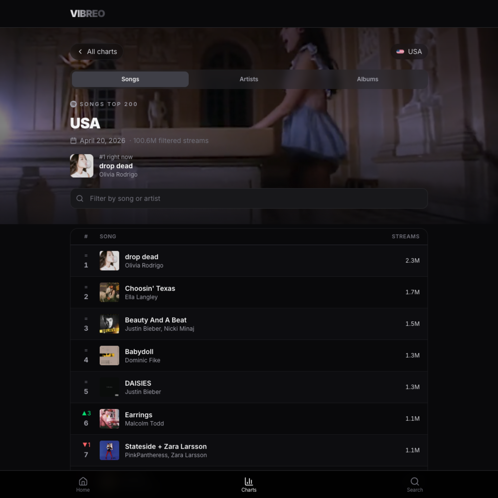

<p align="center">
  
</p>

<h1 align="center">VIBREO</h1>

<p align="center">
  <strong>Music charts that feel alive.</strong>
</p>

<p align="center">
  <a href="https://vibreo.es">Open vibreo.es</a>
</p>

---

## What Is Vibreo?

VIBREO is a music discovery website for checking what is moving across the world right now.

It brings together global and country-level chart views, lets you jump between songs, artists and albums, and wraps the experience in a dark, video-led interface built for quick browsing.

## Screenshots

| Global pulse | USA charts |
| --- | --- |
|  |  |

## What You Can Do

- 🔥 See what is hot globally.
- 🌍 Browse charts by country.
- 🎧 Switch between songs, artists and albums.
- 🔎 Search the catalog.
- 📈 Follow chart movement, streams and positions.
- 🎬 Enjoy video-backed hero sections where available.
- 📱 Use it comfortably on desktop and mobile.

## Where The Data Comes From

The frontend reads from `https://api.vibreo.es`.

The interface may show music and platform metadata related to Spotify, Apple Music, YouTube, iTunes, Shazam and Deezer when that information is returned by the API.

## For Developers

This repository contains the frontend for [vibreo.es](https://vibreo.es).

```bash
npm install
npm run dev
```

Useful checks:

```bash
npm run lint
npm run typecheck
npm test -- --coverage
npm run build
```

Tech stack: Next.js 16, React 19, TypeScript, Tailwind CSS and Jest.

## License

MIT © [Gonzalo López Gil](https://github.com/gonzalopezgil)
